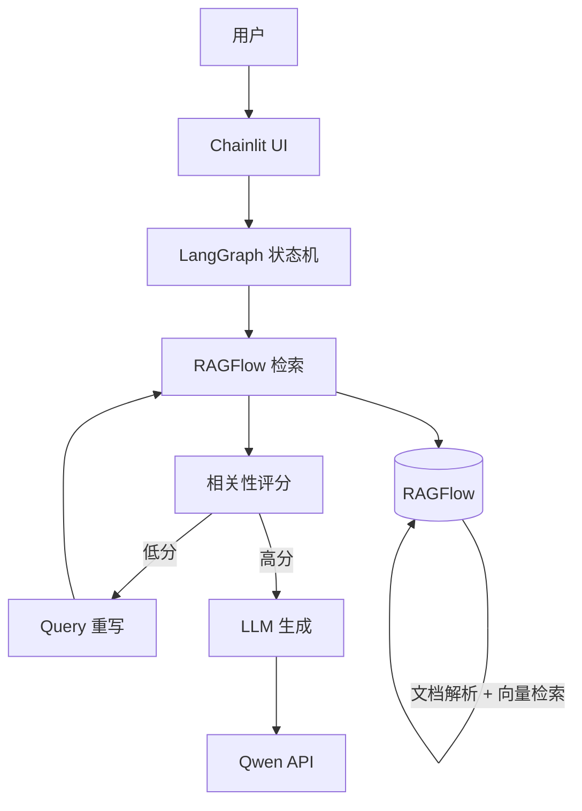

# LocalRAG - 本地高代码 RAG 系统

一个面向开发者的、代码优先（Code-First）的检索增强生成（RAG）系统。通过 LangGraph 实现带自我修正的检索-生成闭环，使用 RAGFlow 进行文档深度解析与向量检索，Ragas 量化评测质量，全部服务 Docker 一键部署。

## 技术栈

| 层级 | 技术 | 职责 |
|------|------|------|
| UI 交互 | Chainlit | ChatGPT 风格聊天界面，流式输出 |
| 逻辑编排 | LangGraph | 检索、生成、评估、重写的状态机 |
| 知识工程 | RAGFlow (fork) | PDF/Excel/Word 深度解析（OCR/布局分析）+ 向量检索 |
| 大模型 | Qwen (通义千问) | 语义理解、推理与生成 |
| 评测 | Ragas (fork) | 检索召回率、生成忠实度量化评测 |

## 系统架构



## 项目结构

```
LocalRAG/
├── .gitmodules                  # Git Submodule 声明
├── .env.example                 # 环境变量模板
├── .env                         # 生产容器配置 (host 指向 Docker 网络名)
├── .env_localtest               # 本地调试配置 (host 指向 localhost)
├── docker-compose.yml           # 顶层服务编排 (App + RAGFlow 依赖)
├── Makefile                     # 快捷命令
│
├── ops/                         # 运维脚本
│   ├── local-setup.sh           # 本地 conda 环境搭建
│   ├── local-start.sh           # 本地调试启动
│   ├── local-stop.sh            # 本地调试停止
│   ├── prod-build.sh            # 生产镜像构建
│   ├── prod-start.sh            # 生产容器启动
│   └── prod-stop.sh             # 生产容器停止
│
├── vendor/                      # 第三方 fork 源码 (Git Submodules)
│   ├── ragflow/                 # fork of RAGFlow (独立提交)
│   └── ragas/                   # fork of Ragas (独立提交)
│
├── app/                         # 应用层代码 (主仓库)
│   ├── Dockerfile
│   ├── requirements.txt
│   ├── main.py                  # Chainlit 入口
│   ├── graph.py                 # LangGraph 状态机定义
│   ├── nodes/                   # 处理节点
│   │   ├── retriever.py         # RAGFlow API 检索
│   │   ├── generator.py         # Qwen API 生成
│   │   ├── grader.py            # 文档相关性评分
│   │   └── rewriter.py          # Query 重写
│   ├── utils/
│   │   └── config.py            # 统一配置加载
│   └── evaluation/
│       └── run_eval.py          # Ragas 离线评测
│
├── configs/ragflow/             # RAGFlow 配置覆盖
├── scripts/init.sh              # 初始化脚本
└── discuss/                     # 设计讨论文档
```

## 快速开始

### 1. 克隆仓库

```bash
git clone --recursive https://github.com/Chengzheqiao/LocalRAG.git
cd LocalRAG
```

### 2. 初始化

```bash
make init
# 或手动执行:
# git submodule update --init --recursive
# cp .env.example .env
# mkdir -p data/qdrant data/ragflow
```

### 3. 配置环境变量

编辑 `.env` 文件，填入必要的 API Key：

```bash
vim .env
```

必须配置：
- `QWEN_API_KEY` — 阿里云通义千问 API Key
- `RAGFLOW_API_KEY` — RAGFlow API Key（在 RAGFlow Web UI 中获取）
- `RAGFLOW_DATASET_IDS` — RAGFlow 知识库 ID（逗号分隔，在知识库设置中获取）

### 4. 启动 RAGFlow 基础设施

```bash
cd vendor/ragflow/docker
docker compose up -d
```

RAGFlow 会自动启动 Elasticsearch、MySQL、MinIO、Redis 等依赖服务。

### 5. 访问服务

| 服务 | 地址 |
|------|------|
| RAGFlow Web UI | http://localhost:80 |
| RAGFlow API | http://localhost:9380 |
| MinIO Console | http://localhost:9001 |

## 多仓库协作

本项目通过 Git Submodule 管理三个独立仓库，各自提交互不影响：

| 操作 | 位置 | 说明 |
|------|------|------|
| 修改应用代码 | 项目根目录 | `git add/commit/push` 提交到 LocalRAG |
| 修改 RAGFlow | `cd vendor/ragflow` | 提交到 RAGFlow fork |
| 修改 Ragas | `cd vendor/ragas` | 提交到 Ragas fork |
| 同步子模块引用 | 项目根目录 | `git add vendor/ragflow` 更新指针后提交 |

## Makefile 命令

```bash
make init               # 初始化子模块、环境变量、数据目录
make up                 # 构建并启动所有 Docker 服务
make down               # 停止所有服务
make logs               # 查看实时日志
make build              # 仅构建镜像
make update-submodules  # 更新子模块到远程最新
make restart SVC=app    # 重启指定服务
```

## 运维脚本 (ops/)

项目提供两套运维脚本，分别对应 **本地调试** 和 **生产容器化** 两种场景。

### 环境配置文件说明

| 文件 | 用途 | Host 指向 |
|------|------|-----------|
| `.env` | 生产容器化部署 (docker-compose) | Docker 内部网络名 (`qdrant`, `ragflow` 等) |
| `.env_localtest` | 本地调试 | `localhost` |
| `.env.example` | 模板，首次使用时复制 | — |

`config.py` 自动按优先级加载: `.env_localtest` 存在则用它，否则回退到 `.env`。Docker 容器中通过 `env_file` 直接注入环境变量，不受文件影响。

### 本地调试 (Local Development)

前提: 基础容器 (RAGFlow 及其依赖) 已通过 Docker 运行，仅 app 模块在本地以 conda 环境运行。

```bash
# 1. 一键搭建 conda 环境 + 安装依赖 (仅首次)
bash ops/local-setup.sh

# 2. 启动本地调试 (自动停止 app 容器、检查基础容器、启动 Chainlit)
bash ops/local-start.sh

# 3. 停止本地调试
bash ops/local-stop.sh
```

### 生产容器化 (Production Docker)

所有服务全部在 Docker 容器内运行。

```bash
# 仅构建镜像 (不启动)
bash ops/prod-build.sh

# 构建并启动所有服务
bash ops/prod-start.sh

# 停止所有服务 (保留数据卷)
bash ops/prod-stop.sh

# 停止并清除数据卷
bash ops/prod-stop.sh --clean
```

## 开发路线

1. **基础设施搭建** — 启动 RAGFlow，上传测试文档验证解析入库
2. **核心链路开发** — 实现 RAGFlow Retrieve -> Qwen Generate 最简链路
3. **增强逻辑** — 加入 Grader + Rewriter 节点，实现自我修正循环
4. **UI 接入** — Chainlit 界面对接 LangGraph 流式输出
5. **评测闭环** — Ragas 离线评测 + 质量报告
6. **多 Agent 扩展** — AgentScope 多角色协作（预留）
