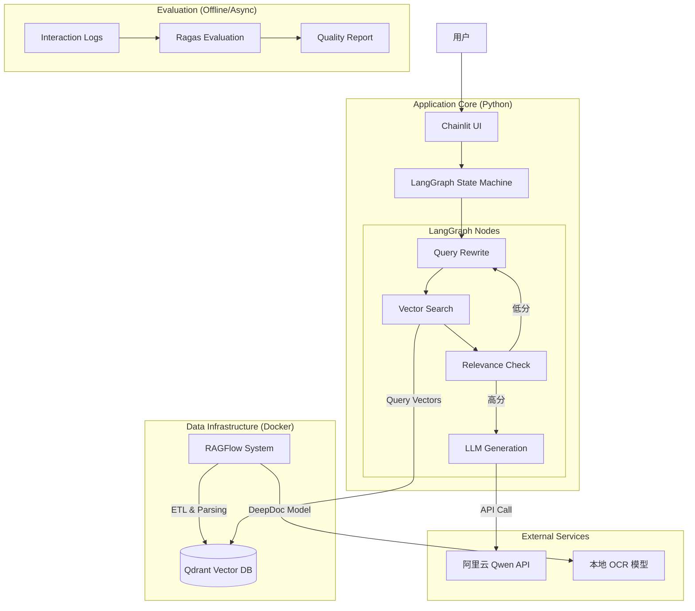

# 本地高代码 RAG 系统概要设计 (High-Code Local RAG)

## 1. 建设目标

构建一个面向开发者的、代码优先（Code-First）的检索增强生成系统。该系统不仅要解决文档解析的精度问题（利用 RAGFlow），还要具备“自我修正”的逻辑闭环（利用 LangGraph），并为未来扩展多 Agent 协作（AgentScope）预留接口。

## 2. 技术栈选型 (已确认)

| 模块 | 选型 | 部署方式 | 核心职责 |
| --- | --- | --- | --- |
| **UI 交互层** | **Chainlit** | Python 本地运行 | 提供 ChatGPT 风格的聊天界面，支持流式输出、中间步骤可视化（Thinking Process）。 |
| **逻辑编排层** | **LangGraph** | Python 本地运行 | 替代 Dify。通过图（Graph）结构定义检索、生成、评估、重写的状态机。 |
| **知识工程 (ETL)** | **RAGFlow** | Docker 容器 | 负责 PDF/Excel/Word 的深度解析（OCR/Layout Analysis），将清洗后的数据写入向量库。 |
| **向量数据库** | **Qdrant** | Docker 容器 | 存储 RAGFlow 处理后的向量数据。作为 RAGFlow 和 LangGraph 的共享数据底座。 |
| **大模型 (LLM)** | **Qwen (通义千问)** | 远程 API | 提供语义理解、推理和生成能力。 |
| **评测体系** | **Ragas** | Python 库 | 计算检索召回率、生成忠实度，提供量化指标。 |

---

## 3. 系统架构图 (逻辑视图)



---

## 4. 核心模块详细设计

### 4.1. 知识工程模块 (Offline Process)

此模块独立于聊天应用运行，是系统的“数据工厂”。

* **工具：** RAGFlow
* **流程：**
1. **上传：** 管理员通过 RAGFlow 的 Web UI 上传技术文档（PDF/Markdown/Excel）。
2. **解析 (DeepDoc)：** RAGFlow 自动识别文档布局，将表格转为 HTML/Markdown 格式，处理跨页段落。
3. **切分 & Embedding：** 自动切片并调用 Embedding 模型（建议使用 BGE-M3，需在 RAGFlow 中配置）。
4. **入库：** 数据存入 **Qdrant** 的指定 Collection 中。
5. **图谱构建 (可选)：** 利用 RAGFlow 的 Graph 功能提取实体关系（三元组），存入 Graph Store (如 Neo4j，RAGFlow 支持配置)。


### 4.2. RAG 业务模块 (Online Process)

此模块是系统的“大脑”，由 LangGraph 定义状态流转。

* **状态定义 (State)：**
```python
class GraphState(TypedDict):
    question: str           # 原始问题
    rewritten_question: str # 重写后的利于检索的问题
    documents: List[Document] # 检索到的切片
    generation: str         # 最终生成的答案
    web_search: bool        # 是否需要联网搜索 (可选扩展)

```


* **核心节点 (Nodes)：**
1. **Query Rewrite Node:** 调用 Qwen，将用户口语化的问题转化为语义精确的搜索 Query。
2. **Retrieval Node:** 直接连接 **Qdrant Client**，对 RAGFlow 生成的 Collection 进行混合检索（Hybrid Search: Dense Vector + Sparse Keyword）。
3. **Grader Node (关键):**
* 调用一个小参数模型（或 Qwen Prompt），判断检索到的文档是否与问题相关。
* *逻辑：* 如果相关性得分 < 0.7，返回 `state="rewrite"`；否则进入 `generate`。


4. **Generation Node:** 拼接 Prompt（System Prompt + Context + Question），调用 Qwen 生成最终回答。


### 4.3. 评测与反馈模块 (RAGOps)

* **数据采集：** Chainlit 的 `cl.on_chat_end` 钩子将本次对话记录（Question, Contexts, Answer）保存到本地 JSON/SQLite。
* **自动化打分：** 编写一个脚本，定期读取日志，运行 Ragas：
* `context_precision`: 检索回来的文档到底有没有用？
* `faithfulness`: AI 回答的是不是基于文档生成的？


* **闭环修正：** 如果发现某篇文档总是导致回答错误，回到 **RAGFlow 后台**，手动修改该文档的切片内容，重新索引。

---

## 5. 项目目录结构建议

为了保持“高代码”的整洁，建议采用以下结构：

```text
my-local-rag/
├── docker-compose.yml       # 启动 Qdrant, RAGFlow, Redis 等基础服务
├── .env                     # 存放 QWEN_API_KEY, QDRANT_URL 等密钥
├── data/                    # 挂载 Qdrant 的持久化数据
├── app/
│   ├── main.py              # Chainlit 入口文件
│   ├── graph.py             # LangGraph 的图结构定义 (核心逻辑)
│   ├── nodes/               # 定义具体的处理节点函数
│   │   ├── retriever.py     # 连接 Qdrant 的搜索逻辑
│   │   ├── generator.py     # 连接 Qwen 的生成逻辑
│   │   ├── grader.py        # 评分逻辑 (自我反思)
│   │   └── rewriter.py      # 问题重写逻辑
│   ├── utils/               # 辅助工具
│   │   └── config.py
│   └── evaluation/          # Ragas 评测脚本
│       └── run_eval.py
└── requirements.txt

```

---

## 6. 实施步骤

1. **基础设施搭建：**
* 编写 `docker-compose.yml`。
* 启动 Qdrant 和 RAGFlow。
* 在 RAGFlow 中创建一个 Dataset，上传几个测试文档，确保解析成功并写入了 Qdrant。


2. **LangGraph 核心链路开发：**
* 编写 Python 代码连接本地 Qdrant。
* 实现最简单的 `Retrieve -> Generate` 链路。
* 在终端测试通过。


3. **增强逻辑开发：**
* 加入 `Grader` 和 `Rewriter` 节点，构建 LangGraph 的条件边（Conditional Edges）。
* 实现“查不到就重写”的循环逻辑。


4. **UI 接入：**
* 使用 `chainlit run app/main.py`。
* 将 LangGraph 的流式输出（Streaming）适配到 Chainlit 的界面上。


5. **未来扩展 (AgentScope)：**
* 当需要引入“多角色”时，新建 `agents/` 目录，封装 AgentScope 代码，并将现有的 LangGraph Pipeline 封装为其中一个 Agent 的 Tool。
